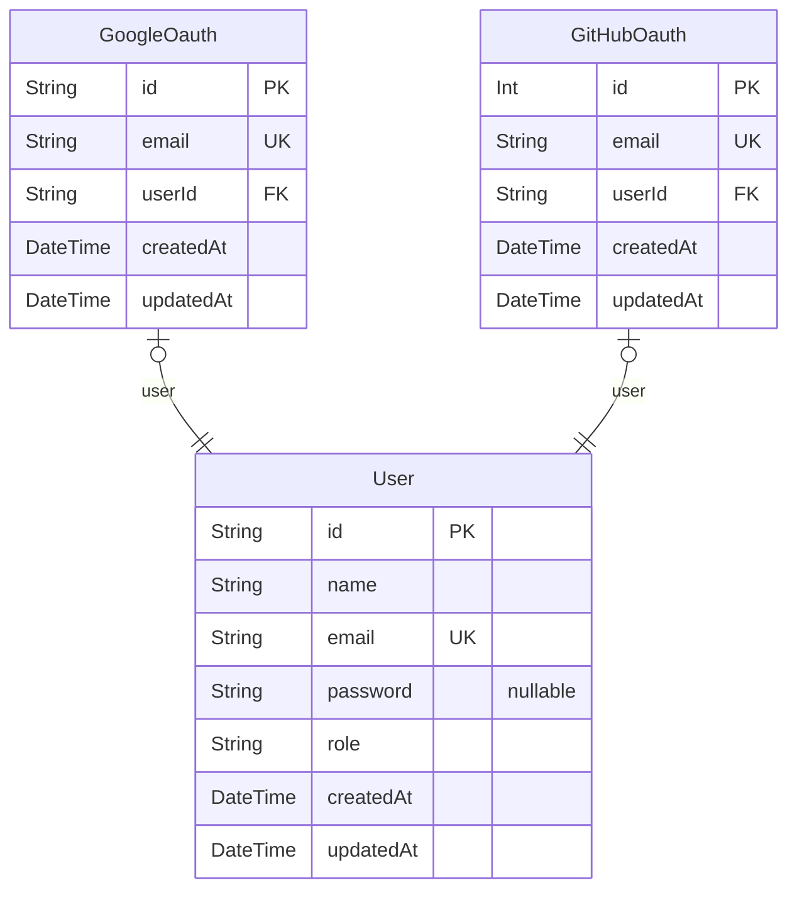

# DB Schema for MIZPOS
> Generated by [`prisma-markdown`](https://github.com/samchon/prisma-markdown)

- [default](#default)

## default

### `User`

**Properties**
  - `id`: 
  - `name`: 
  - `email`: 
  - `password`: 
  - `role`: 
  - `createdAt`: 
  - `updatedAt`: 

### `GoogleOauth`

**Properties**
  - `id`: 
  - `email`: 
  - `userId`: 
  - `createdAt`: 
  - `updatedAt`: 

### `GitHubOauth`

**Properties**
  - `id`: 
  - `email`: 
  - `userId`: 
  - `createdAt`: 
  - `updatedAt`: 